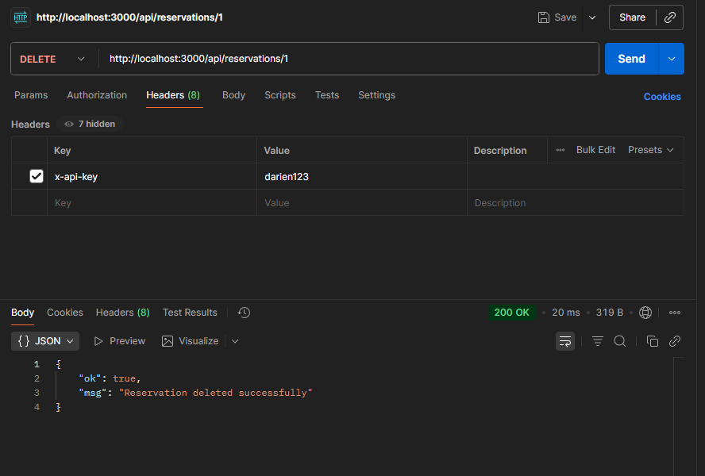
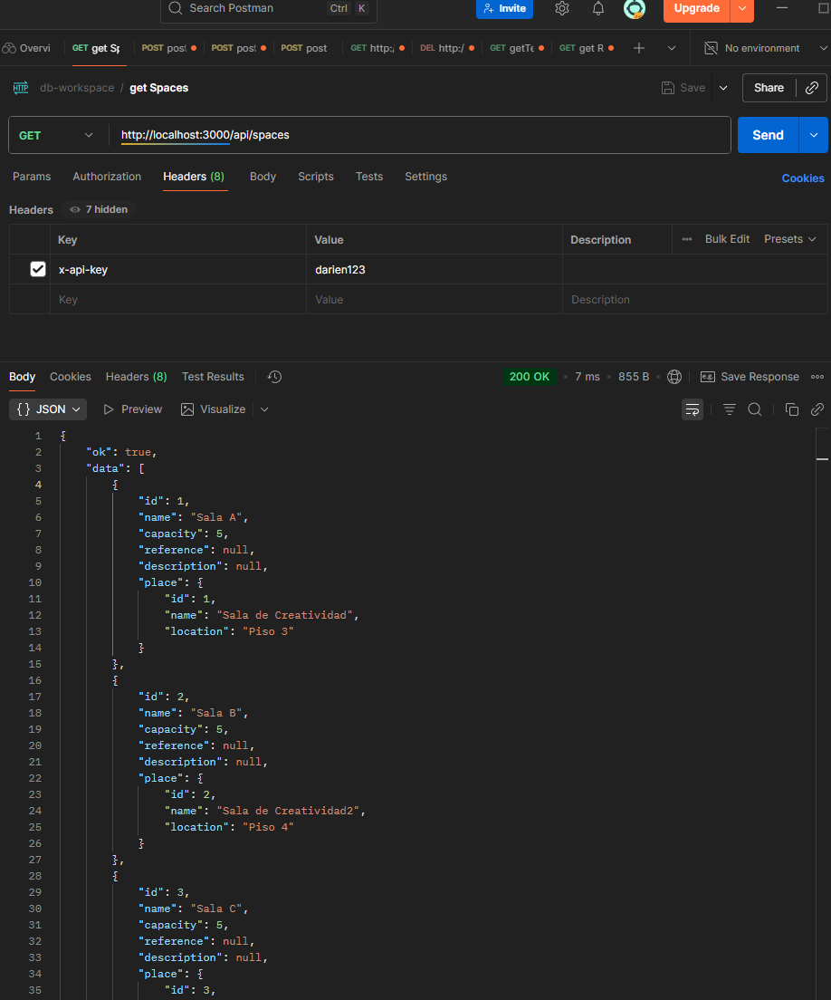
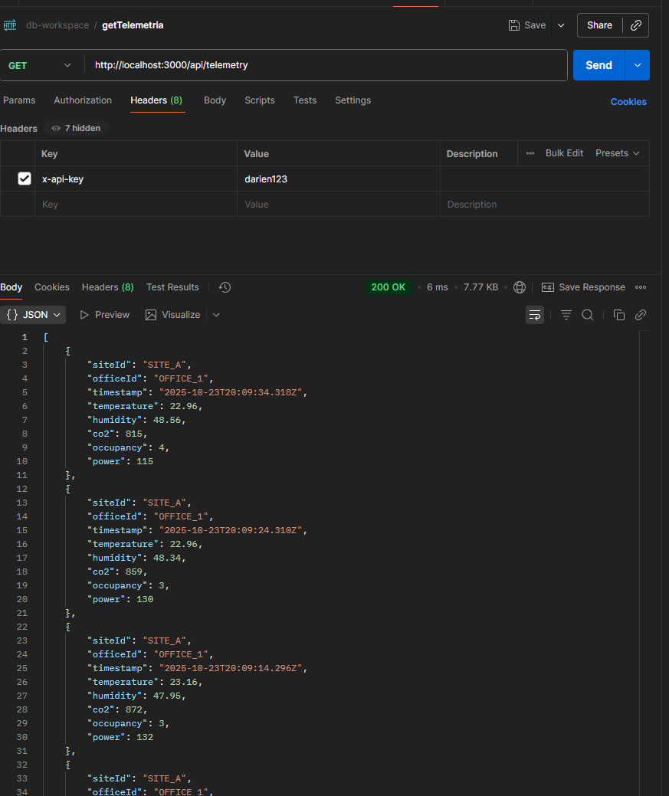
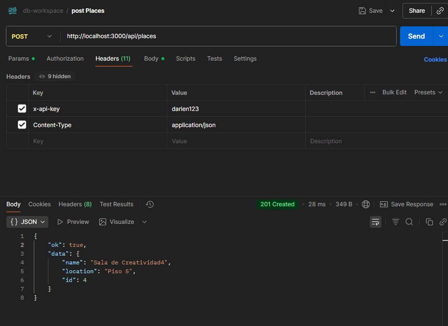
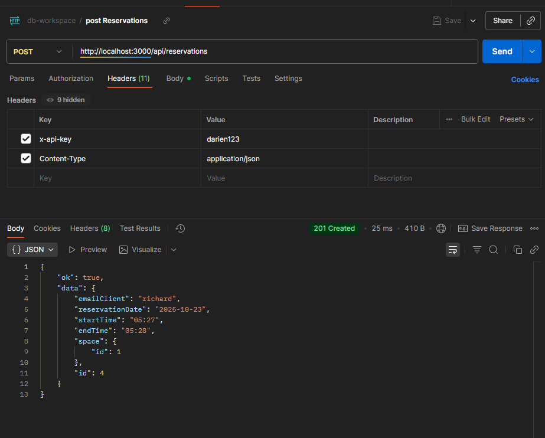
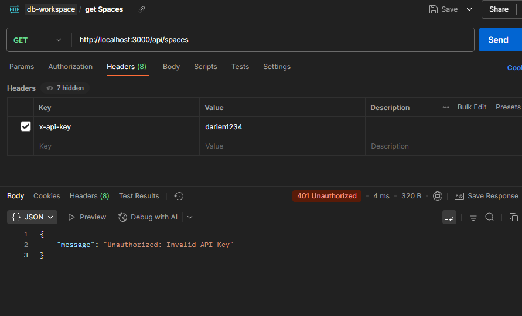

# 📘 Sistema de Gestión de Reservas (Backend)

API RESTful desarrollada en Node.js para gestionar reservas en espacios de coworking. Permite a los clientes 

```
- reservar salas o áreas de trabajo, 
- valida ⛔ conflictos de horario y 🚫 límites semanales, y 
- se integra con telemetría 📡 
- IoT en tiempo real.
```

Tecnologías utilizadas: 🧠 Node.js + Express, 🧪 TypeScript, 🗃️ TypeORM + MySQL, 📡 MQTT, 🧪 Jest + Supertest, ⚙️ Dotenv

Instalación:

```bash
git clone https://github.com/GregHowe/WorkspaceNode.git
cd WorkspaceNode/backend
npm install
```

---

## ⚙️ Configuración

Crear archivo .env con:

```env
PORT=8181
API_KEY=tu_api_key_valida
DB_HOST=localhost
DB_PORT=3306
DB_USER=root
DB_PASSWORD=tu_password
DB_NAME=coworking
MQTT_URL=mqtt://localhost:1883
MQTT_TOPIC=sites/SITE_A/offices/OFFICE_1/telemetry

```
Ejecutar en desarrollo:
npm run dev
---

## 🧪 Ejecución de Pruebas

```bash
npm test
```

Incluye:

- ✅ Test unitario: `checkWeeklyLimit`
- ✅ Test de integración: `validación del límite semanal en base de datos`

---

## 📡 Endpoints Principales

| Método | Ruta                  | Descripción                        |
|--------|-----------------------|------------------------------------|
| GET    | `/spaces`           | Lista todos los espacios           |
| POST   | `/reservations`           | Crea una nueva reserva             |
| GET    | `/reservations?page=1`    | Lista reservas con paginación      |
| DELETE | `/places/:id`        | Elimina un lugar específico        |

🔐 Todos los endpoints requieren el header:  
`x-api-key: tu_api_key_valida`

---

## 🧠 Reglas de Negocio
```
⛔ Un cliente no puede reservar dos espacios en conflicto horario 
🚫 Máximo 3 reservas por semana por cliente 
✅ Validación automática vía checkOverlap y checkWeeklyLimit
```
---

## 📡 Bonus IoT
```
📡 Suscripción al tópico MQTT: sites/SITE_A/offices/OFFICE_1/telemetry 
📊 Procesamiento de datos de sensores: CO₂, temperatura, ocupación, batería
```

## 📸 Capturas de pantalla

A continuación se muestran ejemplos visuales del sistema en funcionamiento:

- 💻 Delete Reservation   

    

- 📊 Get Reservation Pagination   

    

- 📬 Get Spaces  

    

- 💻 Get Telemetria

    

- 📬 Save Place

    

- 📬 Save Reservations

    

- ⚠️ValidationApiKey

    

- ⚠️Unit and Integration Test

    

    

Tiempo de desarrollo: este módulo fue desarrollado como parte del proyecto completo en 🕒 4 días.