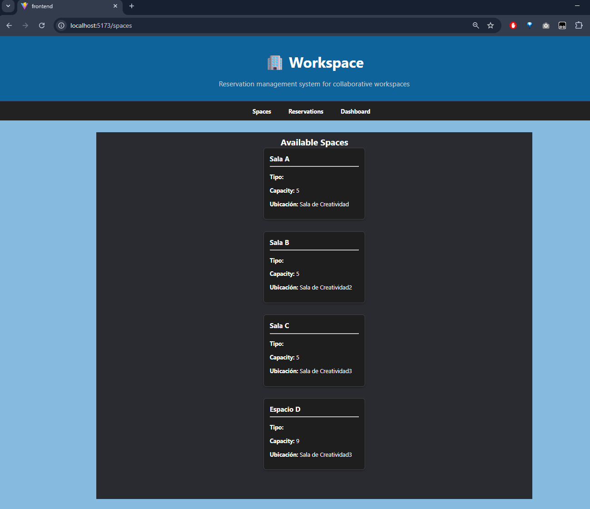
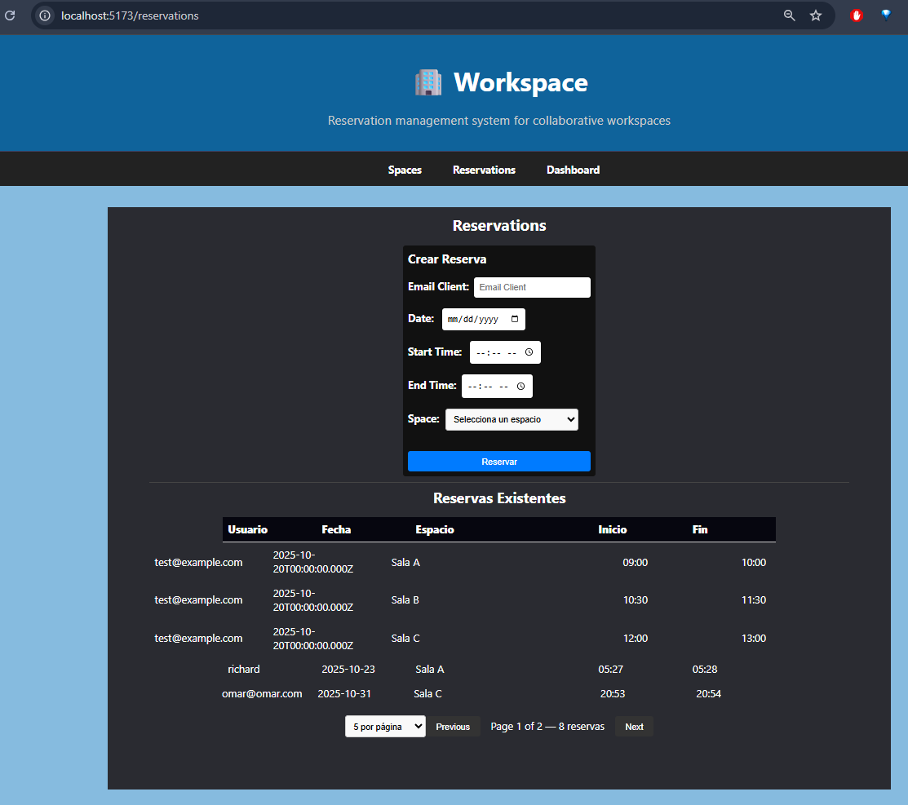
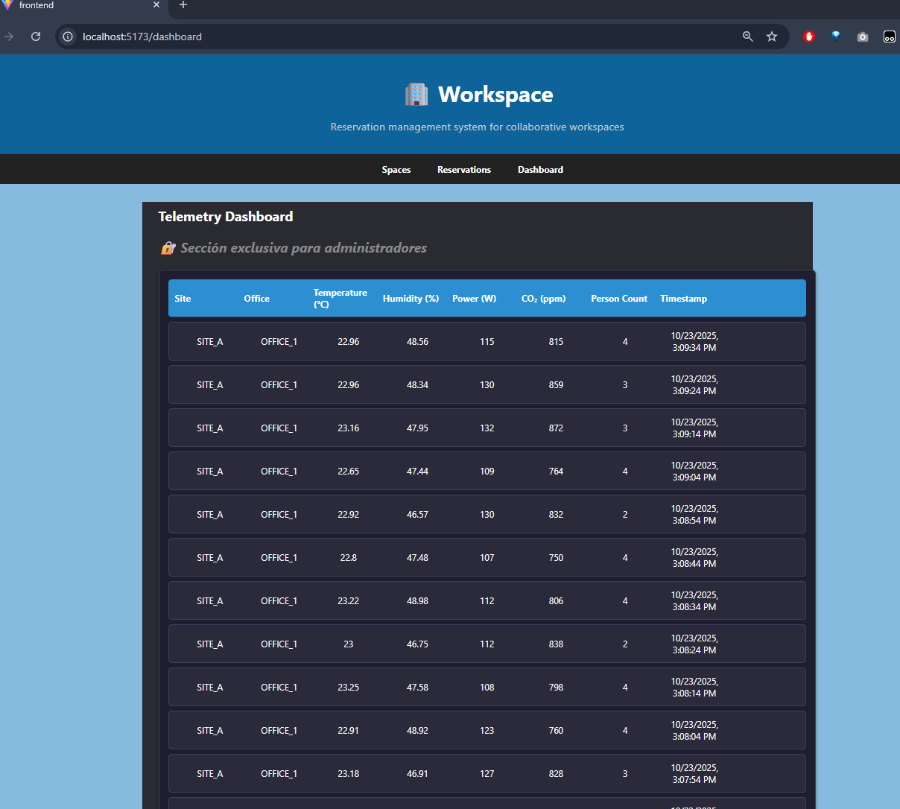
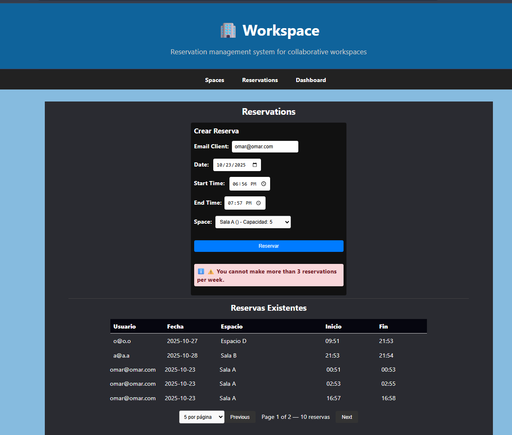
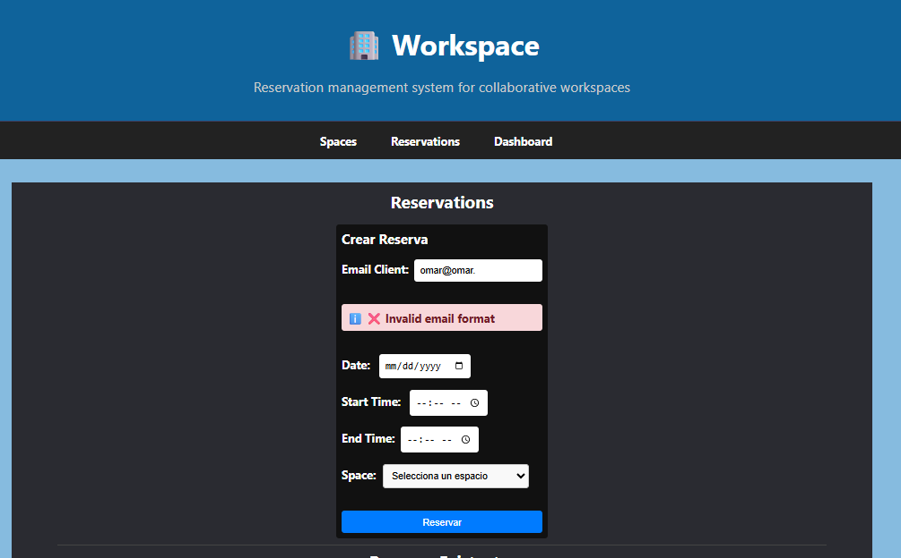
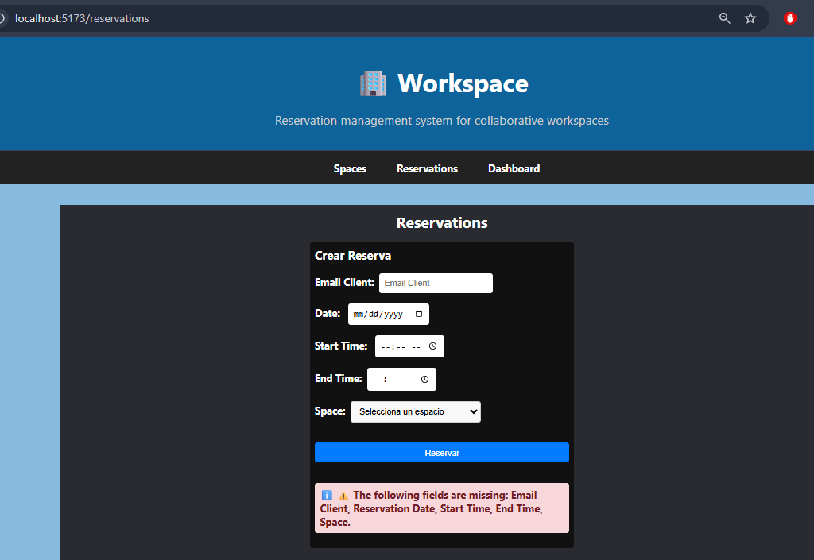

# 💻 Sistema de Gestión de Reservas (Frontend)

```
Interfaz desarrollada en React + TypeScript para gestionar reservas en espacios de coworking. 
Permite a los clientes visualizar espacios, crear reservas, y acceder a un dashboard en tiempo real para administradores. 
Se comunica con el backend mediante API protegida por API Key.
```

Tecnologías utilizadas: ⚛️ React, 🧪 TypeScript, ⚡ Vite, 🔐 API Key, 📡 MQTT (bonus IoT)

Instalación:

```bash
cd frontend
npm install
```

Crear archivo .env con:

```
VITE_API_URL=http://localhost:8181
VITE_API_KEY=mi_api_key_valida
PORT:3000
```

 Ejecutar en desarrollo:
```
 npm run dev
```

Funcionalidades implementadas: 
```
📌 Visualización de espacios disponibles (GET /espacios) 
📌 Visualización de reservas con paginación (GET /reservas?page=1) 
📌 Creación de reservas (POST /reservas) 
📌 Eliminación de reservas (DELETE /reservas/:id) 
📌 Detalle de espacio 
📌 Validación de campos en el formulario de reserva, incluyendo verificación del formato de email en tiempo real mientras el usuario escribe.
✅ Validación de formularios 
⚠️ Manejo de errores con retroalimentación al usuario 
🔐 Autenticación por API Key 
📊 Dashboard en tiempo real para administradores (bonus IoT)
📊 El dashboard incluye un mensaje visual que indica que es exclusivo para administradores, tal como lo solicita el PDF. No se implementa control de acceso real ya que no fue requerido.

```

Bonus IoT: 
```
📡 Conexión al tópico MQTT sites/SITE_A/offices/OFFICE_1/telemetry 
📥 Visualización de datos en tiempo real: 
    👥 ocupación, 
    🌫️ CO₂, 
    🌡️ temperatura, 
    💧 humedad, 
    🔋 batería
```


Requisitos cumplidos: 
```
  ✅ Interfaz funcional con React 
  ✅ Consumo de API protegida 
  ✅ Validaciones y retroalimentación 
  ✅ Bonus IoT implementado 
  ✅ Documentación clara y precisa
```

## 📸 Capturas de pantalla

A continuación se muestran ejemplos visuales del sistema en funcionamiento:

- 💻 Spaces List  

    

- 📊 Get Reservation Pagination   

    

- 📬 Real-Time Telemetry — Simulated IoT Input

    

- 📬 Reserva Validation Max Reservation

    

- 📬 Reserva Validation Email Format

    

- 💻 Reserva Validation Required Fields

    


Tiempo de desarrollo: este módulo fue desarrollado como parte del proyecto completo en 🕒 4 días.
