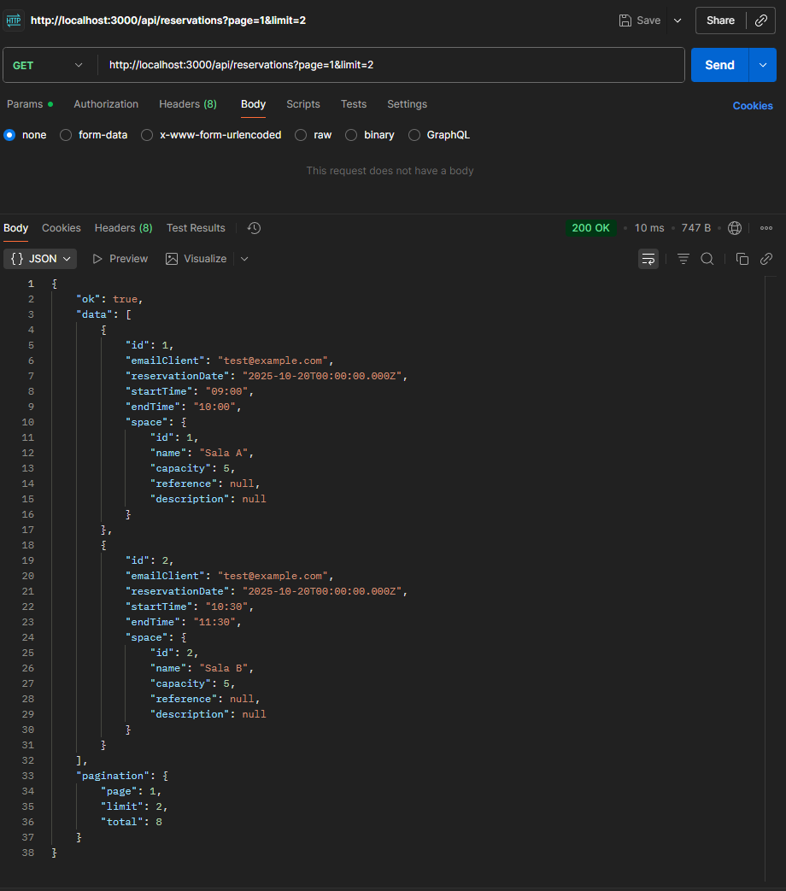

# 🧭 Sistema de Gestión de Reservas — Backend + Frontend + IoT

Este proyecto resuelve la prueba técnica de Darien Technology para la gestión de reservas en espacios de coworking. Incluye 
```
📘 backend en Node.js con TypeORM y MySQL, 
💻 frontend en React con consumo de API protegida por API Key, y 
📡 bonus IoT con integración MQTT para telemetría en tiempo real. 
```

El sistema permite a los clientes reservar salas de reuniones o áreas de trabajo compartido, valida ⛔ conflictos de horario y 🚫 límites semanales, y visualiza 📊 datos de sensores en tiempo real.

Estructura del repositorio: coworking-reservas/  
├── backend/ 🧠 API REST con lógica de negocio y telemetría  
├── frontend/ 🎨 Interfaz React para clientes y administradores

Instalación y ejecución: 🔧 Clonar el repositorio:

```bash
git clone https://github.com/GregHowe/WorkspaceNode.git
cd cWorkspaceNod

---
```
📘 Backend
```
cd backend
npm install
```

```
Crear archivo 
.env con:

PORT=8181
API_KEY=mi_api_key_valida
DB_HOST=localhost
DB_PORT=3306
DB_USER=root
DB_PASSWORD=tu_password
DB_NAME=coworking
MQTT_URL=mqtt://localhost:1883
MQTT_TOPIC=sites/SITE_A/offices/OFFICE_1/telemetry

```

▶️ Ejecutar en desarrollo:
```npm run dev```

🧪 Ejecutar pruebas:
```npm test```

Incluye ✅ test unitario para la lógica de límite semanal (checkWeeklyLimit) y ✅ test de integración para validación del límite semanal en base de datos.


💻 Frontend
```
cd frontend
npm install
```

🛠️ Crear archivo .env con:
```
VITE_API_URL=http://localhost:8181
VITE_API_KEY=mi_api_key_valida
VITE_WS_PORT=3000
git 
```

▶️ Ejecutar en desarrollo:
```
npm run dev
```

🧩 Funcionalidades implementadas
```
📌 visualización de espacios disponibles, 
📌 visualización de reservas con paginación, 
📌 creación y eliminación de reservas, 
📌 detalle de espacio, 
📌 Validación de campos en el formulario de reserva, incluyendo verificación del formato de email en tiempo real mientras el usuario escribe.
📊 El dashboard incluye un mensaje visual que indica que es exclusivo para administradores, tal como lo solicita el PDF. No se implementa control de acceso real ya que no fue requerido.
✅ validación de formularios, 
⚠️ manejo de errores con retroalimentación al usuario, 
🔐 autenticación por API Key, 
🚫 restricción de máximo 3 reservas por semana por cliente, 
⛔ prevención de conflictos de horario, 
📊 dashboard en tiempo real para administradores (bonus IoT).
```

📡 Bonus IoT
```
el backend y frontend están conectados al tópico MQTT sites/SITE_A/offices/OFFICE_1/telemetry. 
Se procesan y visualizan los siguientes datos: 
    👥 ocupación, 
    🌫️ nivel de CO₂, 
    🌡️ temperatura, 
    💧 humedad y 
    🔋 nivel de batería.
```

Pruebas: 
```
El proyecto incluye pruebas automatizadas con Jest. 
Se validan reglas de negocio como el límite semanal y la inserción de reservas reales en base de datos. Las pruebas se ejecutan con npm test desde la carpeta backend.
```

Seguridad: 
```
todos los endpoints están protegidos mediante autenticación por API Key. 
Debe enviarse en cada petición HTTP como header: x-api-key: mi_api_key_valida
```

```
🧠 Uso de Inteligencia Artificial
```
Se utilizó IA como herramienta puntual para:
```
 durante el desarrollo se utilizó 
 🤖 IA como apoyo puntual para 🧪 generar ejemplos de pruebas, 🛠️ diagnosticar errores comunes, 📝 revisar formato Markdown y 🧠 sugerir estructura modular. 
 Todas las decisiones de arquitectura, lógica de negocio, validaciones y estructura modular fueron diseñadas y desarrolladas manualmente por el autor del proyecto. Ver archivo backend/IA.md para más detalles
```

✅ Requisitos cumplidos: 
```
    🧱 arquitectura modular con separación de responsabilidades, 
    🗃️ base de datos relacional con ORM, 
    🔐 autenticación por API Key, 
    🧪 pruebas unitarias e integración, 
    📄 documentación clara y precisa, 
    📡 bonus IoT implementado, 
    💻 frontend funcional con React, 
    ⚙️ validaciones de negocio (conflictos de horario y límite semanal), 
    ⚠️ gestión de errores con mensajes informativos.
```

## 📸 Capturas de pantalla

A continuación se muestran ejemplos visuales del sistema en funcionamiento:

- 📬 Real-Time Telemetry — Simulated IoT Input

    

 - 📊 Get Reservation Pagination   
 
        

Tiempo de desarrollo: este proyecto fue desarrollado en 🕒 4 días, cumpliendo el plazo establecido por la prueba técnica.